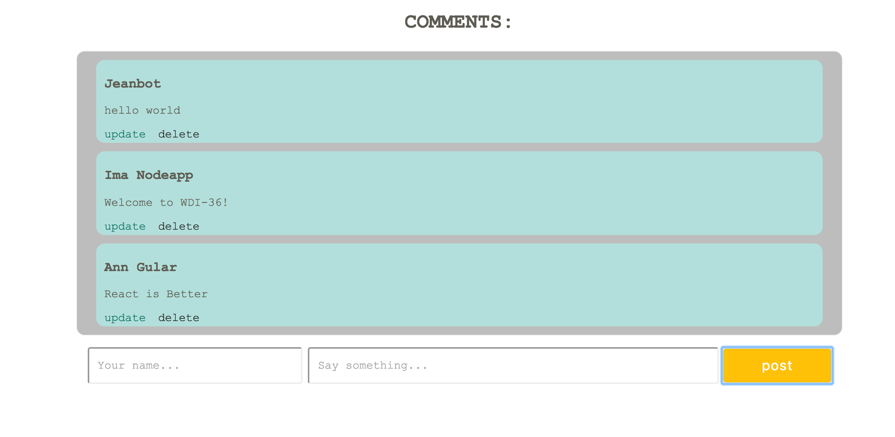

# MERN comment box app

## Objectives

* Utilize React skills to build a comment box frontend
* Apply Mongo and Express knowledge to build a fully functional MERN app

## Intro

So far, we've delved into basic React app frontend architecture. Now, let's take a stab at a full MERN stack CRUD app!

### What you should already know:

* Basic ES6
* Basic React component syntax and structure
* When to use React `state` and `props`
* MongoDB structure and mongoose methods / syntax
* Express routing
* Node/NPM setup

This guide will walk you through a scaffolded MERN stack app - you'll be focusing mainly on the React part of MERN. Definitely take some time during the lab to check out what's going on in `server.js` and re-familiarize yourself with express routing.

## Setup

Clone this repo down and take a look at the file structure.

*Note: If you were to create this React app from scratch, you would be using the command create-react-app mern-comment-box.*

By the end of this lesson, your file structure should end up looking like so:

```
- model
  - comments.js
- node_modules
  - ...various modules...
- src
  - Comment.js
  - CommentBox.js
  - CommentForm.js
  - CommentList.js
  - index.js
  - style.js
- .gitignore
- data.js
- index.html
- package.json
- README.md
- server.js
```

You'll need to create the missing files in the `src` directory to build out our front-end React components.

Make sure to run `npm install --save` to install dependencies!

Take a look at `package.json`. What is familiar? What's new?

* Mongoose, express, body-parser, and nodemon should be familiar.
* jQuery is a library that will let us use HTTP methods to communicate with our database.
* Foreman allows us to boot up our API and webpack-dev-server simultaneously.

You will also notice that we're using a .js file for our styles, which has been provided for you. This is known as *modular inline css styling* and is alternative way to add style. You could also have done this with a .css file.



## Sprints

#### Sprint 1

[Sprint 1: Component Setup](docs/Sprint1.md)

#### Sprint 2

 [Sprint 2: Database Configuration](docs/Sprint2.md)

#### Sprint 3

 [Sprint 3: Procfile and Serving](docs/Sprint3.md)

#### Sprint 4

 [Sprint 4: GET and POST](docs/Sprint4.md)

#### Sprint 5

 [Sprint 5: AJAX](docs/Sprint5.md)

#### Sprint 6

 [Sprint 6: the UD](docs/Sprint6.md)

 #### Sprint 7

  [Sprint 7: ...with a real backend](docs/Sprint7.md)
